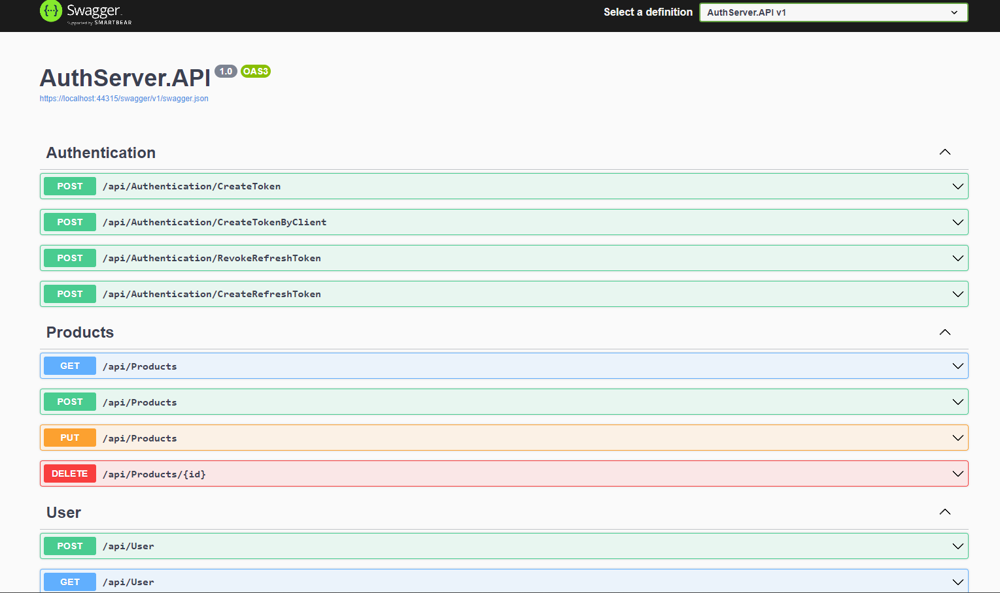
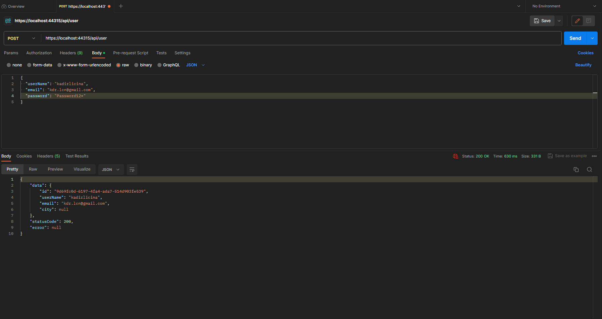
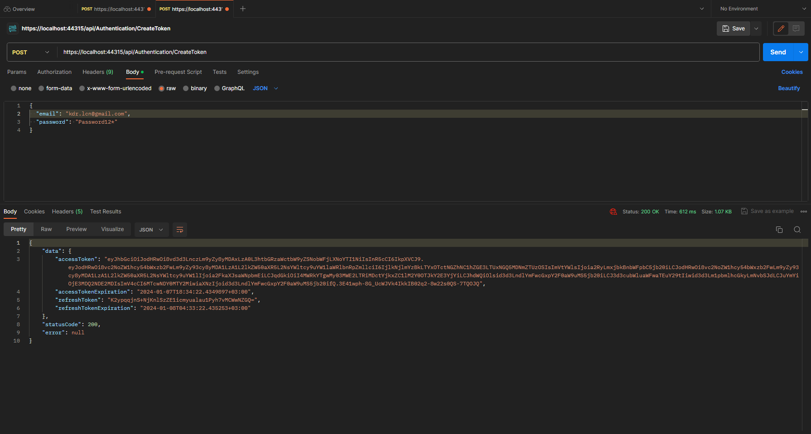
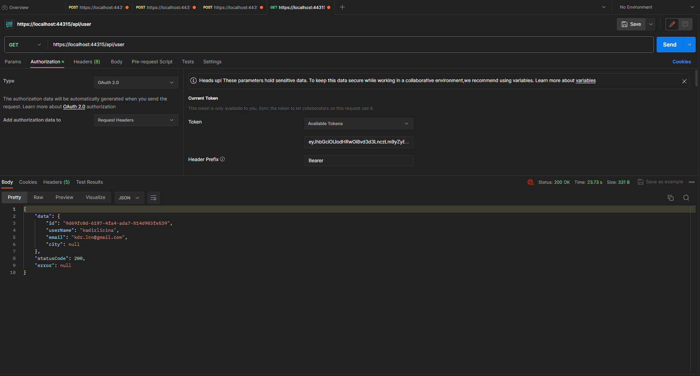
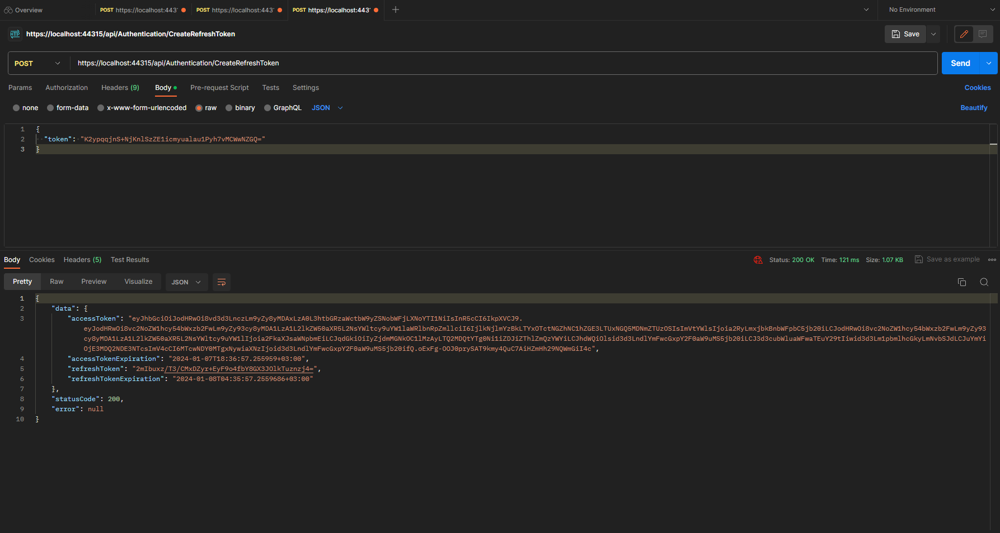
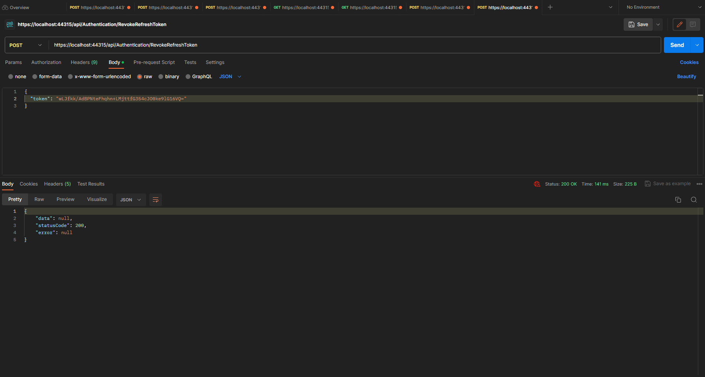
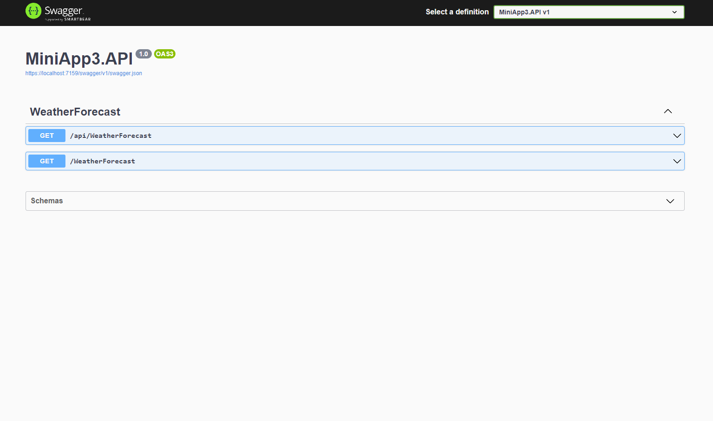
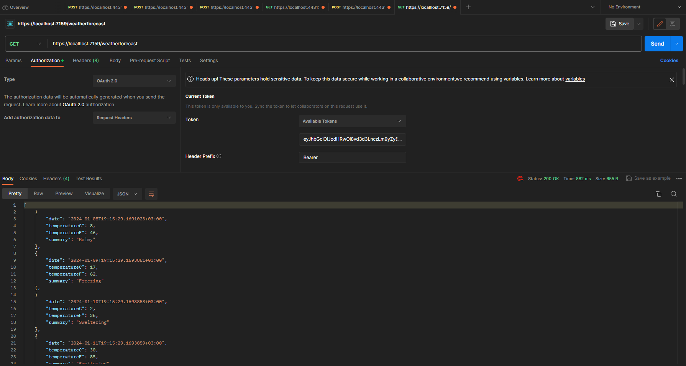

# Content of the Project

>In the project I discussed the structure, features, advantages and disadvantages of JWT. The concepts of Access Token and Refresh Token and their use. It shows how the JWT is integrated with the membership system and how the APIs are protected practically.

----
#### Token Creation 
>Testing of JWTs created for the user with the Postman tool.

>Token retrieval and Token invocation processes have been performed for the User's registration and authentication processes in the system.
----
----
#### Refresh Token Creat & Remove  

>Token retrieval and Token invocation processes have been performed for the User's registration and authentication processes in the system.
----
----
#### Receiving Tokens with Client ID/Client Secret
>How can Clients get tokens with Client ID and Client Secret information without the need for a membership system, and how can they establish an API connection with this token.

